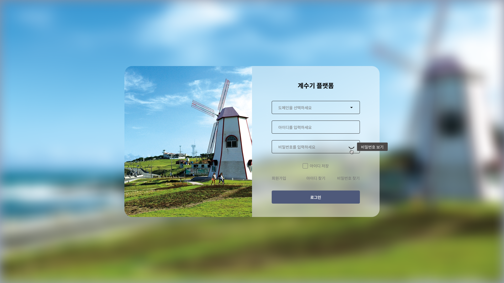
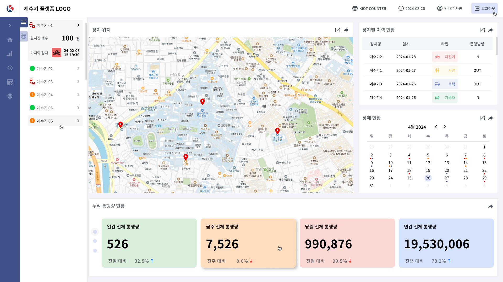
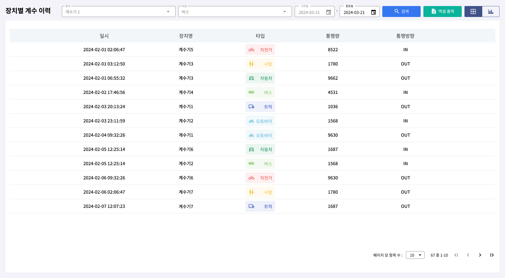
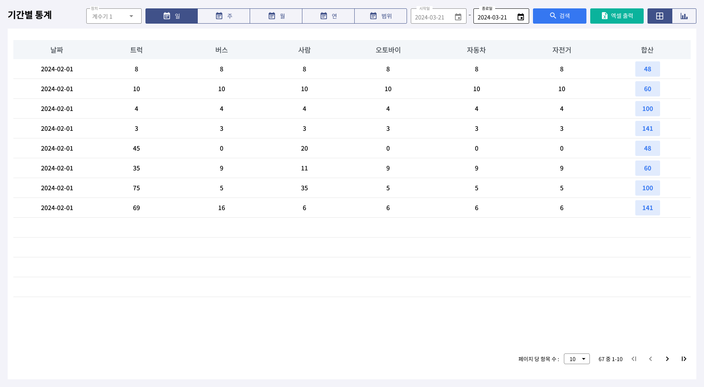
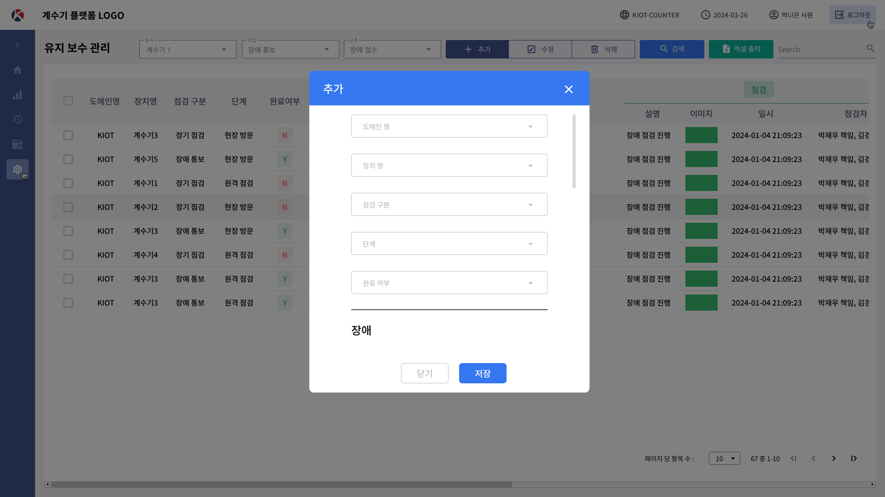

## 

## 👨‍💻 Skills

 
     
     
     
     
     
     
    
     
     
    
    

## 💡 IDEs

 
    
    
    

## 🔭 Project

- #### PHP

- #### JAVA
  
  > 통행량 계수 장치 `관제 및 관리 시스템`
  
  
 
    
    
    
    
    
  

## 📈 History

- 2025.07 ~ : SSAFY
- 2022.11 ~ 2025.04 : (주)KIOT

## 📞 Contect

- 010-4919-8712
- qkrrbghd613@gmail.com

  

